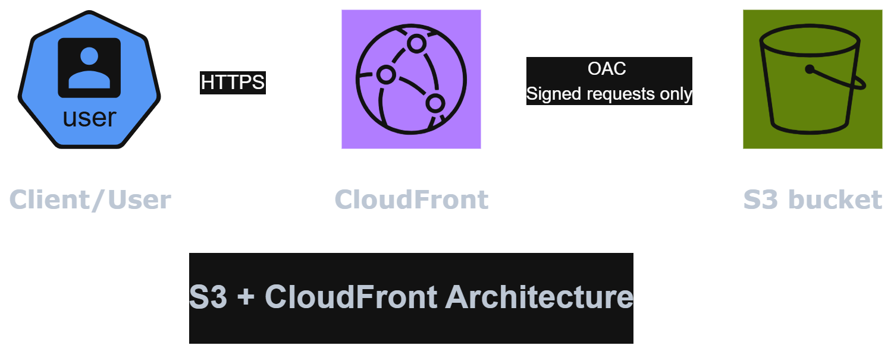

# Architecture - S3 + CloudFront Portfolio Site

## Overview

>A static portfolio site served via CloudFront (CDN) in front of a private S3 bucket. 
>The bucket is never publicly accessible - CloudFront reads from it using Origin Access
>Control (OAC), and the bucket policy restricts access to that specific distribution only.

## Why CloudFront in front of S3, rather than S3 static website hosting alone?

>S3's built-in "static website hosting" mode requires the bucket to be fully public and only serves plain HTTP. 
### Instead, using CloudFront with OAC means:
1. The bucket stays **private** - no public read access at all.
2. **HTTPS by default**, via CloudFront's own certificate, no extra setup.
3. **Caching at edge locations** worldwide - faster load times, fewer direct S3 requests.
4. Access is scoped via bucket policy to **this specific distribution only** (enforced via an `AWS:SourceArn` condition), not "any CloudFront distribution."

## Resources created

| Resource | Purpose |
|---|---|
| S3 bucket (`shurid-portfolio-<account-id>`) | Stores site content, versioning enabled |
| CloudFront Origin Access Control | Identity CloudFront uses to authenticate to S3 |
| CloudFront distribution | CDN + HTTPS termination + caching |
| S3 bucket policy | Grants read access only to the CloudFront distribution above |

## Deployment

Bucket creation and content sync are automated via `scripts/deploy.sh`. CloudFront distribution creation was performed as a one-time setup step (documented above) rather than fully scripted.

## Live URL

https://dmn35l6sg0bps.cloudfront.net
